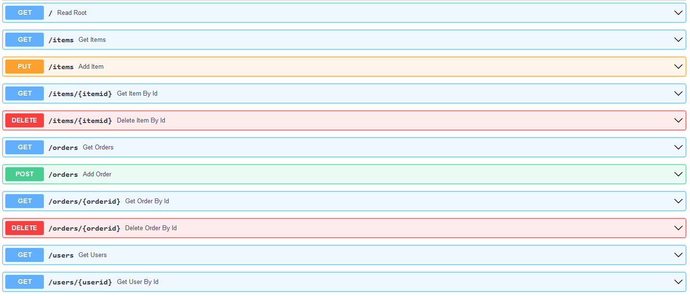

# python-api-webshop
API Development project

The theme is a webshop that has items and orders. For the OAuth component, there also are users.

### Api Links
- [API Endpoint on Okteto](https://example-rmetdep.cloud.okteto.net)

### Postman screenshots

### Docs screenshots
