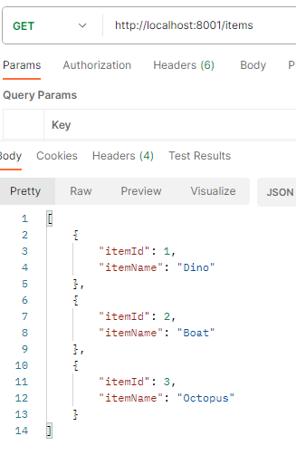
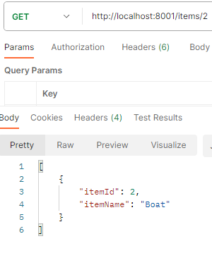
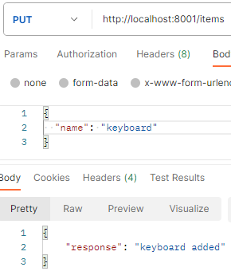
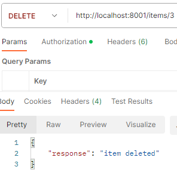
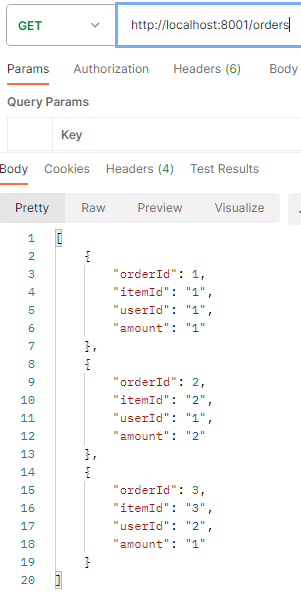
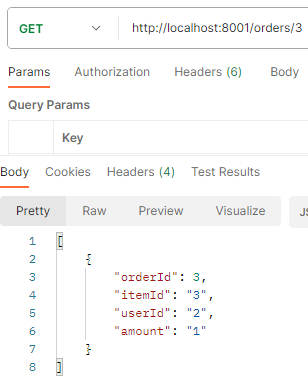
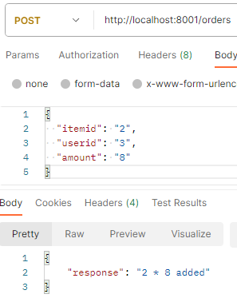
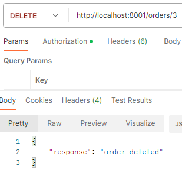
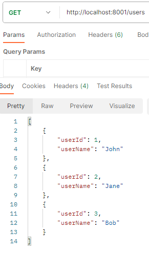
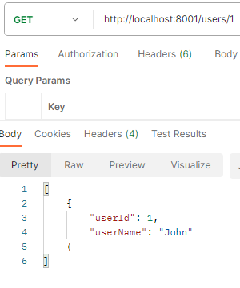

# python-api-webshop
API Development project

The theme is a webshop that has items and orders. For the OAuth component, there also are users.

### Api Links
- [API Endpoint on Okteto](https://task-api-rmetdep.cloud.okteto.net/)

### Postman screenshots

get items  

get items by id  

put items  

delete items  

get orders  

get orders by id  

post orders  

delete orders  

get users  

get users by id  

### Docs screenshots
